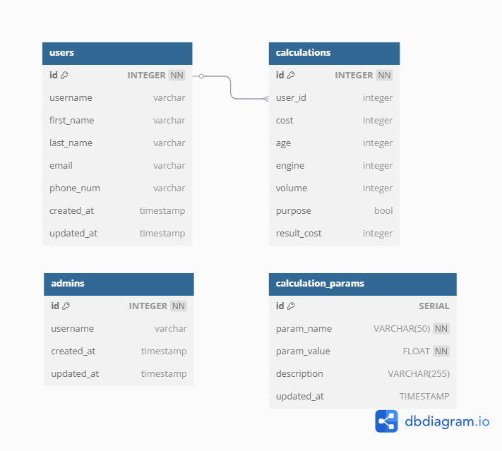

# Japan Auto Import Bot

Telegram-бот калькулятор таможенных услуг для компании импортера автомобилей из Японии

### **✨ Основные функции:**

- **Пошаговый расчет** – введите цену в йенах, возраст, тип двигателя, объем и назначение авто
- **Обновление ставок** – актуальные ставки пошлин и сборов, настраиваются через бота админа
- **Связь с менеджером** – кнопка для быстрого оформления заявки
- **Гибкие настройки** (для админов) – изменение параметров расчета

### 🛠 Технологический стек

- Python 3.8+
- Telebot (python-telegram-bot)
- PostgreSQL 13+

### 📊 Структура базы данных

